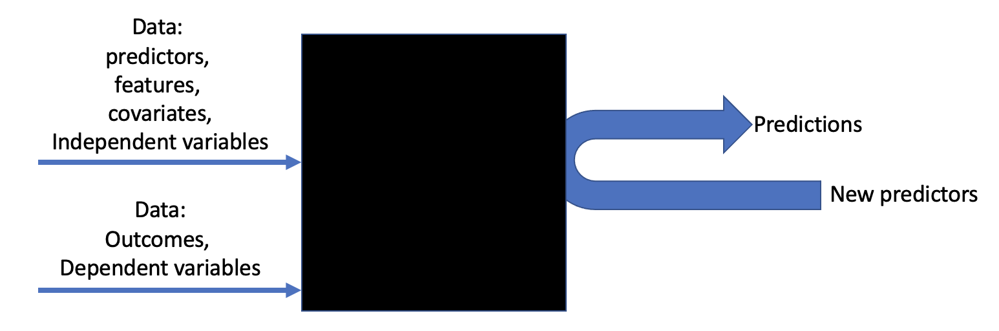
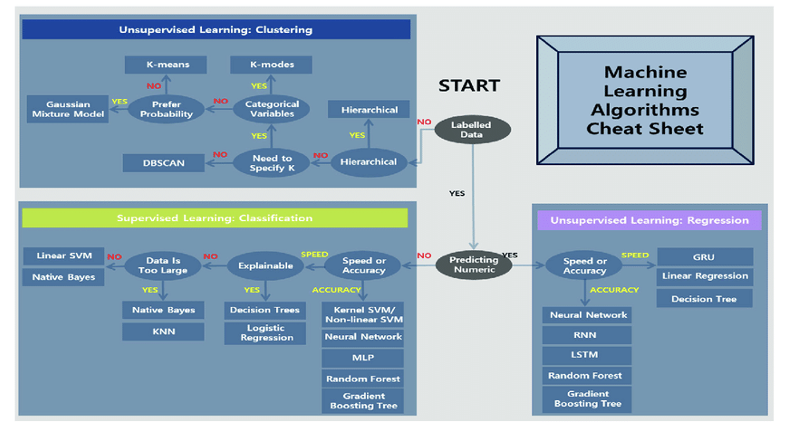
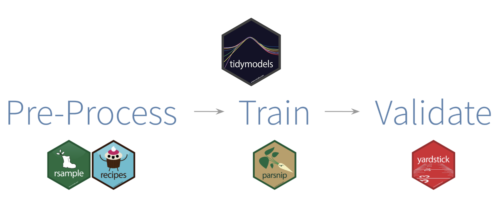
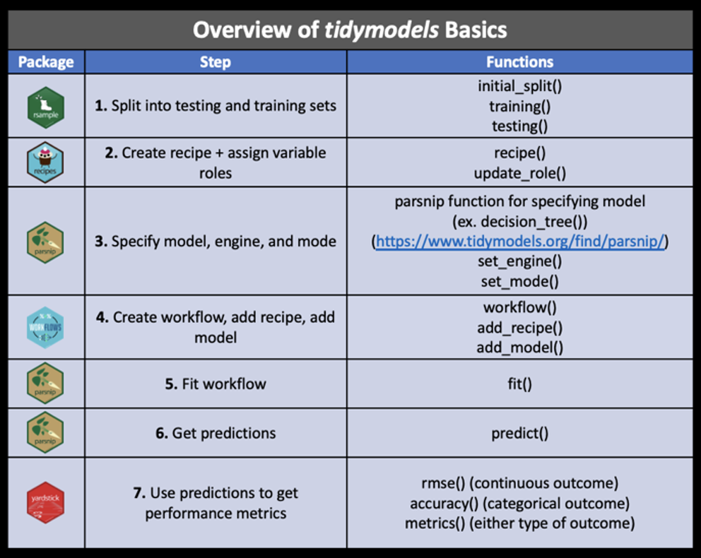

## Surprise

You have already done machine learning in class

$~$

Linear regression from the lake ice model

$~$

```         
fit <- lm(doy ~ year, data = sunapee)
```

## Prediction vs. understanding

-   Modeling for **understanding**
    -   Parameters and model matter
    -   e.g., is the parameter that relates temperature to growth different from zero?
-   Modeling for **prediction**
    -   Quality of prediction matters
    -   Machine learning!

## Machine learning

> Machine learning is a field of inquiry devoted to understanding and building methods that "learn" -- that is, methods that leverage data to improve performance on some set of tasks. - Wikipedia



## Broad classes of ML

::::: columns
::: {.column width="50%"}
### Supervised

-   *Labels* are available for each set of predictors

-   *Labels* can be classes (e.g., cat or dog) or numbers (e.g., 3.7)

-   Goal is to predict the *labels*
:::

::: {.column width="50%"}
### Unsupervised

-   *Labels* are NOT available for each set of predictors.

-   Goal is to use predictors to create groups
:::
:::::

## Broad classes of ML

::::: columns
::: {.column width="50%"}
### Supervised

-   Examples:
    -   Images are labeled by a human (criminal vs. non-criminal)
    -   Values are provided for a continuous variable (i.e., stream nitrate)
:::

::: {.column width="50%"}
### Unsupervised

-   Examples:
    -   Recommendation systems - if you like a movie, ML can find movies like it to recommend
    -   What are the characteristics of different groups that buy a product?
:::
:::::

## ML Flow chart



::: aside
https://www.researchgate.net/publication/347633181_Detection_of_Smoking_in_Indoor_Environment_Using_Machine_Learning
:::

## Big picture steps in ML

0. Define the question (what are you predicting...is it ethical?)

1.  Obtain data
2.  Pre-process data (also called feature engineering)
    -  Define data splits (training vs. testing - often 80%/20% split)
3.  Define the model and workflow
    -  Type of ML model (supervised vs. unsupervised, regression vs. classification).
    -  Identify the method that will be used (this influences how data will be pre-processed)
    -  Define a specific approach for applying the model (i.e., which R package)

## Big picture steps in ML

4.  Fit (train) model to [training]{.underline} data
5.  Predict the testing data
6.  Evaluate (validate) the model with [testing]{.underline} data (need to evaluate with testing data because ML learns the training data)
7.  Train model on all data
8.  Deploy model (predict new data).

## Lake Ice module as ML

0.  Define question: **what is the lake ice in 2040?**
1.  Obtain data: **read_excel**
2.  Pre-process data: **I already converted the date to DOY**
    -  Define data splits: **we didn't do this**
3.  Define the model and workflow
    -  Define the type of ML: **supervised regression**
    -  Identify the method that will be used: **linear regression**
    -  Define a specific approach for applying the model: `lm`

## Lake Ice module as ML

4.  Fit (train) model to training data: `lm(doy ~ year, data = sunapee)`
5.  Predict the testing set: **we didn't do this**
6.  Evaluate (validate) the model with testing data: **we didn't do this**

## Lake Ice module as ML

7. Train model on all data.  **we did this**
8. Deploy model (predict new data): **predicted for the year 2040**

## Tidyverse take on ML

Tidymodels (meta-package)



## Tidymodels

> The tidymodels framework is a collection of packages for modeling and machine learning using tidyverse principles.

$~$

> Whether you are just starting today or have years of experience with modeling, tidymodels offers a consistent, flexible framework for your work.

::: aside
https://www.tidymodels.org
:::

## Tidymodels

<p align="center">



</p>

::: aside
https://rpubs.com/chenx/tidymodels_tutorial
:::

## Overview of module: Dataset

-   Forest carbon from NEON (from prior module)

## Overview of module: Plan

-   Tuesday: Instruction in tidymodels applied to predicting carbon
-   Thursday: In-class assignment apply to predicting lake ice
-   Tuesday: Instruction in using different models and tuning using ML models
-   Thursday: Quiz and instruction in applying models to classification.

## Focal dataset

Predicting the mean vegetation carbon stocks for each plot in the NEON data

Columns

```{r}
biomass <- readr::read_csv("assignment/data/neon_biomass.csv", show_col_types = FALSE)
colnames(biomass)
```

Number of rows

```{r}
nrow(biomass)
```

## Challenge

### Predict out-of-sample data

-   You have the "predictors" for 57 additional sites
-   I have the carbon stocks
-   You will submit your predictions of these 57 via Canvas
-   We will summarize and compare the results.

## Success in the module

-  Before Thursday: study and review tutorial1-machine-learning-101.qmd
-  Complete In-class assignment on Thursday using knowledge from the tutorial
-  After next Tuesday, review tutorial2-example-with-tuning.qmd
-  Use knowledge from tutorial1 and tutorial2 to complete the assignment.
